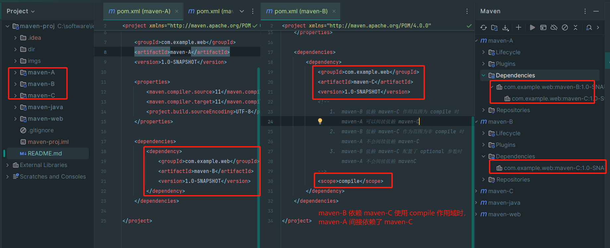
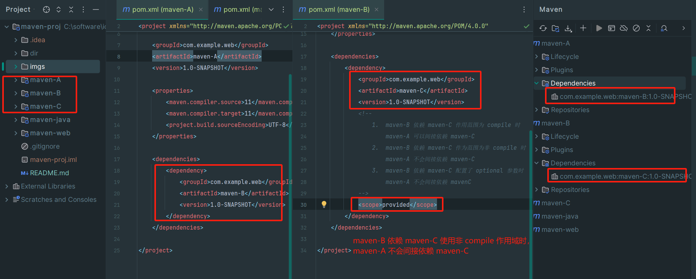
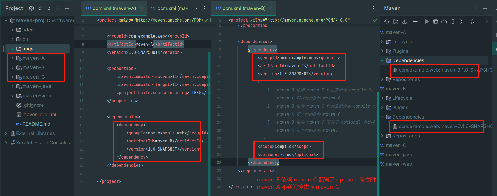
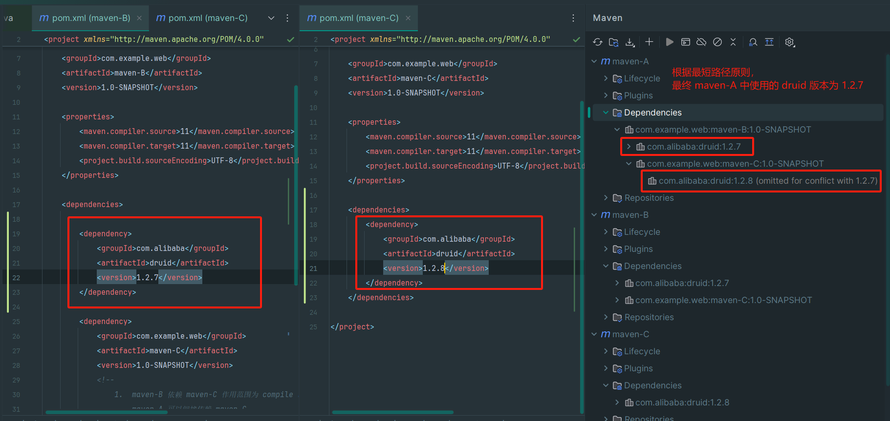
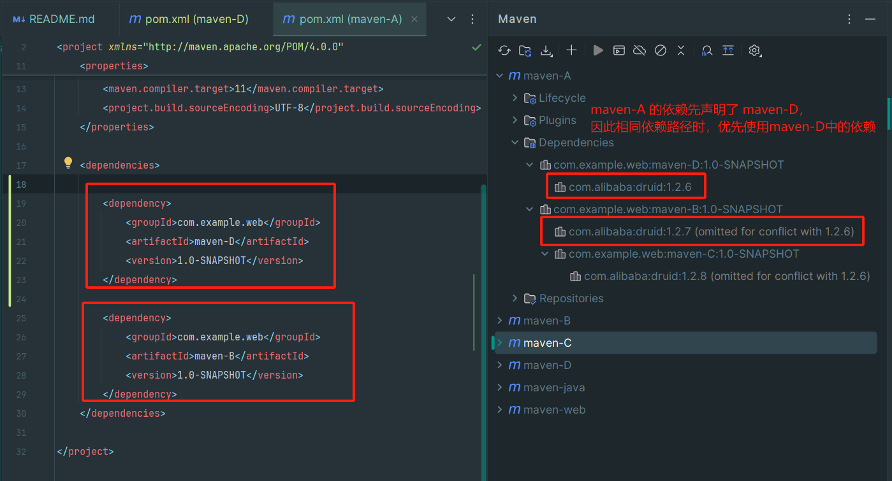
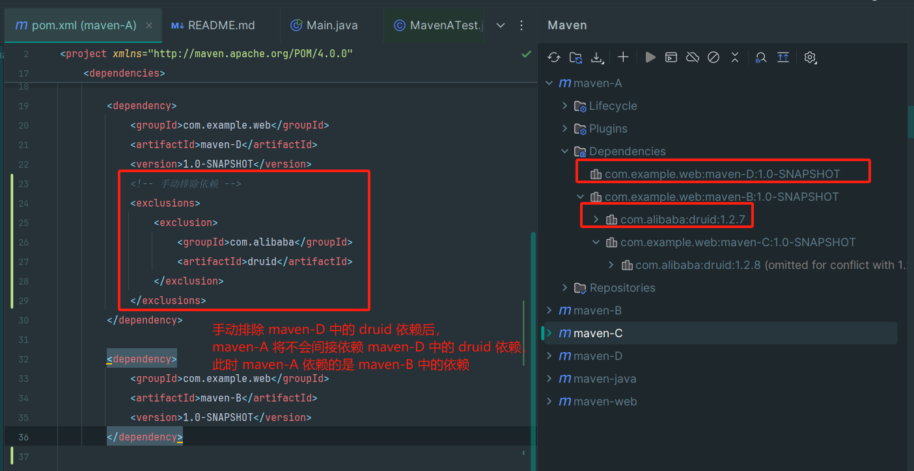
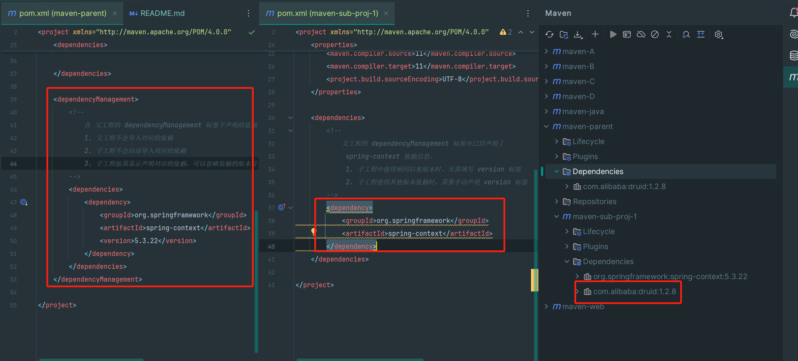
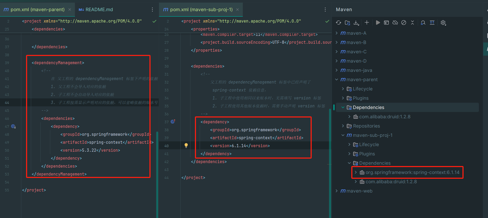
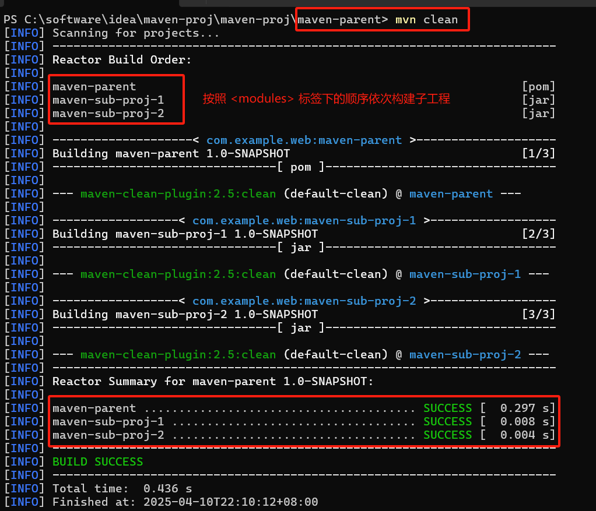
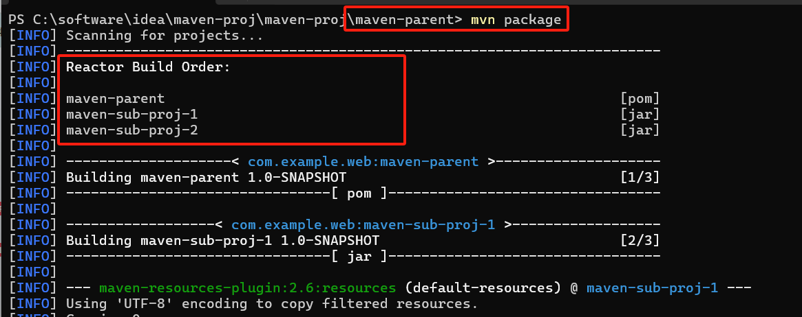

[toc]

# Maven的安装和配置

maven地址
https://mvnrepository.com/

maven下载地址
https://maven.apache.org/download.cgi

maven归档地址
https://archive.apache.org/dist/maven/maven-3/

## 环境变量配置

1. 新增 `MAVEN_HOME` 环境变量，只想maven项目

```text
MAVEN_HOME=C:\software\maven\apache-maven-3.8.6
```

2. 新增 `path` 环境变量

```text
%MAVEN_HOME%\bin
```

3. 验证maven环境变量配置

```text
mvn -version
mvn -v

Apache Maven 3.8.6 (84538c9988a25aec085021c365c560670ad80f63)
Maven home: C:\software\maven\apache-maven-3.8.6
Java version: 11.0.19, vendor: Oracle Corporation, runtime: C:\software\jdk11\Install
Default locale: zh_CN, platform encoding: GBK
OS name: "windows 11", version: "10.0", arch: "amd64", family: "windows"
```


## 修改 maven 配置

### 修改本地仓库地址

1. 打开 maven 项目下的 `conf/settings.xml` 配置文件;
2. 通过 `<localRepository>` 标签配置自定义本地仓库目录;

```xml
<?xml version="1.0" encoding="UTF-8"?>
<settings xmlns="http://maven.apache.org/SETTINGS/1.2.0"
          xmlns:xsi="http://www.w3.org/2001/XMLSchema-instance"
          xsi:schemaLocation="http://maven.apache.org/SETTINGS/1.2.0 https://maven.apache.org/xsd/settings-1.2.0.xsd">
    <!-- localRepository
      maven本地仓库目录配置
     | The path to the local repository maven will use to store artifacts.
     |
      默认缓存在 ${user.home}/.m2/repository
     | Default: ${user.home}/.m2/repository
      配置自定义仓库目录设置
    <localRepository>/path/to/local/repo</localRepository>
    -->
    <!-- 配置maven本地仓库地址 -->
    <localRepository>C:\software\maven\repository</localRepository>

    .....
</settings>
```

### 修改镜像地址

1. 打开 maven 项目下的 `conf/settings.xml` 配置文件;
2. 通过 `<mirror>` 标签添加自定义镜像地址;

```xml
<?xml version="1.0" encoding="UTF-8"?>
<settings xmlns="http://maven.apache.org/SETTINGS/1.2.0"
          xmlns:xsi="http://www.w3.org/2001/XMLSchema-instance"
          xsi:schemaLocation="http://maven.apache.org/SETTINGS/1.2.0 https://maven.apache.org/xsd/settings-1.2.0.xsd">
    ...
    <mirrors>
        <!-- 阿里云镜像 -->
        <mirror>
            <!-- 镜像唯一标识符，内容可以自定义，需要保证全局唯一，避免与其它仓库的id重复 -->
            <id>aliyun-maven</id>
            <!-- 镜像的描述名称，内容可以自定义 -->
            <name>阿里云公共仓库</name>
            <!-- 镜像的访问地址， -->
            <url>https://maven.aliyun.com/repository/public</url>
            <!-- 当前镜像覆盖的原始仓库，maven 默认中央仓库的 id 为 center -->
            <mirrorOf>central</mirrorOf>
        </mirror>
    </mirrors>
    ...
</settings>
```

## 项目结构与pom文件

### maven gavp

maven 工程相对于之前的项目，多出了一组 `gavp` 属性 (`groupdId`, `artifactId`, `version`, `packaging`)， `gav`
属性需要在创建项目的时候指定，`p` 有默认值，这四个属性主要为每一个项目在 maven 仓库中做一个标识。

- `groupId`: com.{公司/BU}.业务线.[子业务线]
- `artifactId`: 产品线-模块名
- `version`: 主版本号.次版本号.修订号 (1.0.1)
    - 主版本号: 当做了不兼容的 API 修改，或者增加了能改变产品方向的新功能;
    - 次版本号: 当作了向下兼容的功能新增 (新增类，接口等);
    - 修订号: 修复bug等;
- `packaging`: 表示需要将项目打包成什么类型的文件
    - `jar` (默认值): 代表普通 java 工程，打包以后是 `jar` 结尾的文件;
    - `war`: 代表 java 的 web 工程，打包以后是 `.war`结尾的文件;
    - `pom`: 代表不会打包，用来做继承的父工程;

### maven 标准项目结构

```text
my-project/
├── src/
│   ├── main/              # 项目主要代码
│   │   ├── java/          # Java源代码目录
│   │   └── resources/     # 资源目录，存放配置文件、静态资源等
│   └── test/              # 项目测试代码
│       ├── java/          # 单元测试目录
│       └── resources/     # 测试资源目录
├── target/                # 构建输出目录
└── pom.xml                # maven 项目管理文件
```

# Maven 工程构建

## 构建的概念和构建过程

项目构建是指将源代码、依赖库和资源文件等转换成可执行文件或可部署的应用程序的过程，在这个过程中包括编译源码、链接依赖库、打包和部署等多个步骤。

项目构建是软件开发过程中至关重要的一部分，他能够有效的提高软件开发效率，使得开发人员能够更加专注于应用程序的开发和维护，而不必关心应用程序的构建细节。

同时项目构建能够将多个开发人员的代码汇合到一起，并能够自动化项目的构建和部署，大大降低项目的出错风险和提高开发效率。

maven 默认生命周期定义了构建时所需执行的所有步骤，是maven生命周期的核心部分

```text
包含命令: compile -> test -> package -> install -> deploy
```

## 命令方式项目构建

| 命令                 | 描述                                   |
|--------------------|--------------------------------------|
| `mvn compile`      | 编译项目，生成 `target` 文件                  |
| `mvn test-compile` | 编译项目 (包含 test 目录下的代码)，生成 `target` 文件 |
| `mvn package`      | 打包项目，生成 `jar` 或 `war` 文件             |
| `mvn clean`        | 清理编译 或 打包 后的项目结构                     |
| `mvn install`      | 打包后上传到 `maven` 本地仓库                  |
| `mvn deploy`       | 只打包，上传到 `maven` 私服仓库                 |
| `mvn site`         | 生成站点                                 |
| `mvn test`         | 执行测试代码                               |

### `mvn clean`

清理编译 或 打包 后的项目结构


清理后得到目录


### `mvn compile`

编译项目，生成 `target` 目录


编译后得到 `target` 产物如下


### `mvn test-compile`

编译项目 (包含 test 目录代码)， 生成 `target` 目录


编译后得到 `target` 产物如下


### `mvn package`

打包项目，生成 `.jar` 或 `.war` 文件


打包后得到 `target` 产物如下


### `mvn install`

打包后上传到 `maven` 本地仓库


打包完成后上传到 `maven` 本地仓库


# `Maven` 依赖管理

## `maven` 工程核心信息配置 (`GAVP`)

`pom.xml`

```xml
<!-- 模型版本 -->
<modelVersion>4.0.0</modelVersion>

        <!-- maven工程的坐标 -->
<groupId>org.example.maven</groupId>
<artifactId>maven-java</artifactId>
<version>1.0-SNAPSHOT</version>

        <!--
            maven工程的打包方式
            jar (默认): 普通java项目打包方式，项目打成 jar 包
            war: web项目打包方式，项目打成 war 包
            pom: pom 方式不会将项目打包，这个项目作为父工程，被其他项目聚合或继承
        -->
<packaging>jar/war/pom</packaging>
```

## `maven` 工程依赖管理配置

`pom.xml`

```xml

<properties>
    <maven.compiler.source>11</maven.compiler.source>
    <maven.compiler.target>11</maven.compiler.target>
    <project.build.sourceEncoding>UTF-8</project.build.sourceEncoding>
    <!-- 配置junit版本号 -->
    <junit.version>4.13.2</junit.version>
</properties>

<dependencies>
<!-- 导入 junit 依赖 -->
<dependency>
    <groupId>junit</groupId>
    <artifactId>junit</artifactId>
    <!-- 使用 properties 中定义的属性值 -->
    <version>${junit.version}</version>
    <!-- scope 属性可选 -->
    <scope>test</scope>
</dependency>
</dependencies>
```

## 依赖范围

通过设置坐标的依赖范围 (`<scope>`)，可以设置对应 jar 包的作用范围: 编译环境、测试环境、运行环境;

| 依赖范围       | 描述                                                                                                                                          |
|------------|---------------------------------------------------------------------------------------------------------------------------------------------|
| `compile`  | 编译依赖范围，`scope` 元素的缺省值 (默认值)。使用此依赖范围的 `Maven` 依赖，对于三种 `classpath` 均有效，即该 `Maven` 依赖在上述三种 `classpath`均会被引入。例如 `log4j` 在 编译、测试、运行过程都是必须的。      |
| `test`     | 测试依赖范围，使用此依赖范围的 `Maven` 依赖，只对测试 `classpath` 有效。例如 `junit` 依赖只有在测试阶段才需要。                                                                     |
| `provided` | 依赖在编译和测试阶段需要，但运行时由容器提供，不会打包到最终构建结果。例如，`servlet-api` 依赖对于编译、测试阶段而言是需要的，但是运行阶段，由于外部容器已经提供了对应依赖，因此无需重复引入;                                      |
| `runtime`  | 运行时范围依赖，使用此依赖范围的 `Maven` 依赖，只对测试`classpath`、运行`classpath` 有效，例如: `JDBC` 驱动实现依赖，其在编译时只需 `JDK` 提供的 `JDBC` 接口即可，已有测试、运行阶段才需要实现了 `JDBC` 接口的驱动;  |
| `system`   | 系统范围依赖，其效果与 `provided` 的依赖范围一致，用于添加非 `Maven` 仓库的本地依赖，通过依赖元素 `dependency` 中的 `systemPath` 元素指定本地依赖路径。鉴于使用 `system` 依赖会导致项目的可移植性降低，一般不推荐使用;   |
| `import`   | 导入依赖范围，该依赖范围只能与 `dependencyManagement` 元素配合使用，其功能是将目标 `pom.xml` 文件中 `dependencyManagement` 的配置导入合并到当前 `pom.xml` 的 `dependencyManagement` 中; |

在 `maven-web` 项目下执行打包命令 `mvn package` ，此时 `compile`、`test`、`provided` 三个作用域的依赖，只有 `compile`
作用域的依赖被打入到最终的产物中


### `Maven` 工程 `build` 构建配置

项目构建是指将源代码、依赖库和资源文件等转换成可执行或可部署应用程序的过程，在这个过程中包括编译源代码、链接依赖库、打包和部署等多个步骤。

默认情况下，构建不需要额外配置，构建过程都有对应的缺省配置。

#### 设置打包产物的名称

```xml

<build>
    <!--
        自定义打包名称，jar包产物的名称
    -->
    <finalName>maven-java-output</finalName>
</build>
```

配置后，执行打包命令 `mvn package` 得到编译的 jar 包如下


#### 指定打包文件

如果在 java 目录中添加类，mvn 构建时会将其编译到 `classes` 目录下，但是如果在 java 目录中添加非 java 类 (例如: `.xml`
文件)，此时该文件默认不会被打包。

默认情况下，按照 maven 工程结构放置的文件会默认被编译和打包，除此之外，还可以使用 `<resources>`
标签，指定要打包资源的目录，例如 `mybatis` 中有时会将 `mapper` 映射文件编写在 java 目录中。

```xml

<build>
    <!--
         配置自定义打包的资源位置
         例如: 配置将 src.org.example.mapper 目录下的所有 .xml 结尾的文件都打包到 jar 包中
     -->
    <resources>
        <resource>
            <!-- 配置包目录 -->
            <directory>src/main/java/org/example/mapper</directory>
            <includes>
                <!--
                    配置匹配规则
                    ** 表示 directory 目录下(包含子目录)
                    *.xml 表示任意 .xml 结尾的文件
                -->
                <include>**/*.xml</include>
            </includes>
        </resource>
    </resources>
</build>
```

执行 `mvn package` 命令后，可以在 `classes` 目录中找到对应的 xml 文件


# `Maven`依赖传递和依赖冲突

## `Maven` 依赖的传递性

当项目 A 依赖 B 库，B 库又依赖 C 库 ( `A -> B -> C` )，此时 `maven` 会将 C 库作为项目 A 的间接依赖引入到项目中，这就是依赖的传递性。

依赖传递的规则: 在 `A -> B -> C` 依赖链路中，C 是否能够传递到 A 取决于 B 依赖 C 时使用的依赖范围以及配置。

- B 依赖 C 时，`scope` 为 `compile`: C 可以传递到 A;



- B 依赖 C 时，`scope` 为 `test` 或 `provided`: C 不能传递到 A，此时如果需要 C 的依赖时，A需要明确的配置 C 的依赖。



- B 依赖 C 时，配置了以下标签时，C 不能传递到 A;

```xml

<dependency>
    <groupId>com.alibaba</groupId>
    <artifactId>druid</artifactId>
    <version>1.2.15</version>
    <optional>true</optional>
</dependency>
```



> 依赖传递终止的场景

- 非 `compile` 范围进行依赖传递;
- 使用 `optional` 标签配置终止传递;
- 依赖冲突 (传递的依赖已经存在);

## `Maven` 依赖冲突特性

当直接引用或者间接引用出现了相同的 jar包，项目中就会出现相同重复的 jar包，此时会出现依赖冲突。`maven`
会按照自己的规则进行重复依赖的选择，此外也提供了手动解决冲突的方式。

> 解决依赖冲突的方式

maven 默认处理的方式

- 路径最短优先原则

`A -> B -> C - X(version:1.2.1)`

`A -> B -> X(version: 1.1.1)`

根据路径最短优先原则，A 最终会依赖 `x(version:1.1.1)` 版本的sdk



- 依赖路径长度相同情况下，使用 先声明优先原则

`A -> D -> X(version:1.0.1)`  // 假设D声明在B之前

`A -> B -> X(version:1.2.1)`

根据路径相同，采用 先声明原则，最终 A 会依赖 `X(version:1.0.1)`



> 手动解决依赖冲突问题

使用 `exclusion` 标签标注需要移除的依赖坐标

```xml

<dependency>
    <groupId>com.example.web</groupId>
    <artifactId>maven-D</artifactId>
    <version>1.0-SNAPSHOT</version>
    <!-- 手动排除依赖 -->
    <exclusions>
        <exclusion>
            <groupId>com.alibaba</groupId>
            <artifactId>druid</artifactId>
        </exclusion>
    </exclusions>
</dependency>
```



# `Maven`工程继承和聚合关系

## `maven` 工程继承关系

`maven` 工程继承关系是指在 `maven` 项目中，让一个项目从另一个项目中继承配置信息的机制。继承可以让我们在多个项目中共享同一配置信息，简化项目的管理和维护工作。

> 继承作用，可以在父工程中统一管理项目中的依赖信息

- 对于一个比较大的项目进行拆分。
- 在一个 `project` 下创建很多个 `module`;
- 每一个 `module` 都需要配置自己的依赖信息 (每个 `module` 维护自己的依赖信息容易出现冲突);

> 继承语法

父工程 `pom` 文件中，通过 `<packaging>pom</packaging>` 标签声明当前项目用于管理 `maven` 项目，不参与打包;

父工程中通过 `<modules>` 标签聚合子模块

- 子模块的路径是相对于父工程的 `pom.xml` 文件所在目录的;
- 子模块默认按照 `<modules>` 中的生命顺序构建;
- 子模块可以是独立的 `maven` 项目，也可以有自己的 `<modules>` (多级聚合);

step1: 父工程 `pom.xml` 文件中

```text
<groupId>com.example.web</groupId>
<artifactId>maven-parent</artifactId>
<version>1.0-SNAPSHOT</version>
<!--
    由于父工程不需要参与打包，因此打包方式需要改成 pom
-->
<packaging>pom</packaging>

<modules>
  <!-- 配置子模块的路径 -->
  <module>../maven-sub-proj-1</module>
</modules>
```

step2: 子工程的 `pom.xl` 文件中配置

- `parent.groupId`: 必填，父项目的 `groupId`;
- `parent.artifactId`: 必填，父项目的 `artifactId`;
- `parent.version`: 必填，父项目的版本号;
- `relativePath`: 选填，父 `pom` 的相对路径
    - 默认值为 `../pom.xml` (从子项目的上级目录中查找);
    - 若 父 `pom` 不在默认路径，需要显示声明 父 `pom` 路径 (例如: `../maven-parent/pom.xml`);
    - 若 父 `pom` 已经存在于仓库中 (例如公司私服)，则可以省略 `<relativePath>` 属性;

子工程的 `groupId` 和 `version` 建议同父工程保持一致，子工程 `groupId`、`version` 和 父工程 `groupId`、`version`
一致时，子工程 `pom` 文件中只需要声明子工程的 `artifactId` 即可;

```xml
<!-- 声明父工程的坐标 -->
<parent>
    <groupId>com.example.web</groupId>
    <artifactId>maven-parent</artifactId>
    <version>1.0-SNAPSHOT</version>
    <!--
        配置父容器的路径
        1. <relativePath> 默认值为 ../pom.xml，即默认从当前子模块的上级目录查找;
        2. 若父 pom 不在默认路径，则需要显式声明 父 pom 路径 (例如当前配置 ../maven-parent/pom.xml)
        3. 若父 pom 已存在于仓库中 (例如公司私服)，可以省略 <relativePath>
    -->
    <relativePath>../maven-parent/pom.xml</relativePath>
</parent>

        <!-- 子工程的 groupId 和 version 同父工程保持一致时，子工程 pom 只需要声明 artifactId -->
<artifactId>maven-sub-proj-1</artifactId>
```

## `<dependencies>` 和 `<dependencyManagement>`

| 特性        | `<dependencies>`                     | `<dependencyManagement>`   |
|-----------|--------------------------------------|----------------------------|
| 依赖是否生效    | 直接生效，添加到类路径                          | 不生效，仅定义版本                  |
| 子模块是否需要声明 | 子模块自动继承，无需声明                         | 子模块必须显示声明依赖，可以省略版本号        |
| 版本覆盖      | 子模块无法覆盖父工程中声明的依赖 </br> (路径最短优先原则)    | 子模块可以显示指定版本号覆盖**父工程中的定义**  |
| 典型场景      | 所有子模块共享的基础依赖 (例如: `junit`、`Logback`) | 需要统一版本的依赖 (例如: `spring` 等) |

> case1: 在 父 `pom` 的 `<dependencies>` 标签下声明依赖，父工程导入对应的依赖，子模块自动继承依赖


> case2: 在 父 `pom` 的 `<dependencyManagement>` 标签下生命依赖，父工程仅仅声明依赖，不会导入依赖，子工程需要手动导入依赖



> case3: 在 父 `pom` 的 `<dependencyManagement>` 标签下生命依赖，父工程仅仅声明依赖，不会导入依赖，子工程需要手动导入依赖,且使用不同的
> version 版本



## `Maven` 聚合关系

`Maven` 聚合是指将多个项目组织到一个父工程中，以便一起构建和管理的机制。聚合可以帮助我们更好的管理一组相关的子项目，同时简化他们的构建和部署过程。

聚合的作用

- 管理多个子项目: 通过聚合，可以将多个子项目组织在一起，方便管理和维护;
- 构建和发布一组相关的项目: 通过聚合，可以在一个命令中构建和发布多个相关的项目，简化了部署和维护工作;
- 优化构建顺序: 通过聚合，可以对多个项目进行顺序控制，避免出现构建依赖混乱导致构建失败的情况;
- 统一管理依赖项: 通过聚合，可以在父工程中管理公共依赖项和插件，避免重复定义;

> maven-parent mvn clean



> maven-parent mvn package




